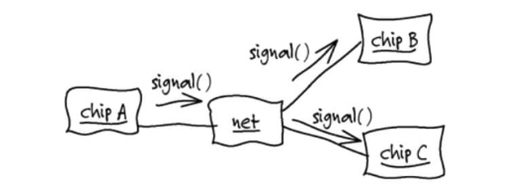
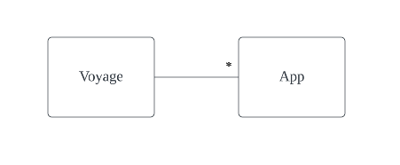
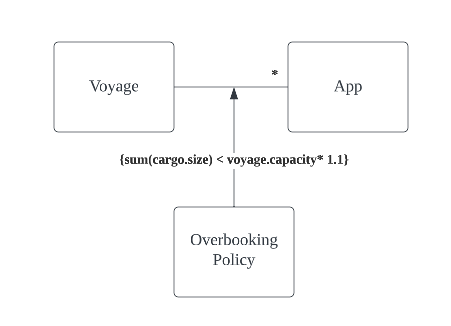

- [지식 탐구](#-지식-탐구)
  * [효과적인 모델링의 요소](#-효과적인-모델링의-요소)
  * [지식 탐구](#-지식-탐구-)
  * [지속적인 학습](#-지속적인-학습)
  * [풍부한 지식이 담긴 설계](#-풍부한-지식이-담긴-설계)
    + [예제 - 감춰진 개념 추출하기](#-예제---감춰진-개념-추출하기)
  * [심층 모델](#-심층-모델)

# 지식 탐구
에릭 에반스가 인쇄 회로 기판(PCB, printed-circuit borad) 설계에 특화된 소프트웨어 툴을 설계하면서 도메인 모델을 찾아간 경험을 소개한다.  

*첫번째 도메인 발견*
- 에릭 에반스는 전자 기기에 대해 전혀 모르기 때문에 PCB 설계자들과 만나서 대화를 해도 PCB를 이해할 수 없었다.  
- 반대로 PCB 설계자들은 소프트웨어에 대한 이해도가 떨어져서 소프트웨어의 기능을 설명하기 어렵다.
- 여러 번의 회의는 실망스러웠지만, 보고서에 공통적으로 네트(net) 란 말과 세부사항이 적혀있는 것을 발견하고, 도메인 모델의 첫번째 요소를 찾는데 성공했다.
> 네트: PCB 상에 있는 도선. 이 도선을 통해 여러개의 컴포넌트와 연결할 수 있꼬, 연결된 곳에 전기적인 신호를 전달할 수 있다.

*브레인 스토밍과 정제*  

- 약식으로 객체 상호작용 다이어그램을 그려가며 PCB 전문가와 기능에 대해 토의함
- 이 과정에서 PCB 전문가는 틀린 부분을 바로잡아주고, 의미가 상충하거나 모호한 용어를 제거함
  - PCB 전문가 간의 기술적 견해차가 해소
  - 정확하고 일관성 있게 설명하기 시작하며 모델을 발전시켜감
> ex. 네트-칩이 연결된 다이어그램을 보고 "컴포넌트는 칩일 필요가 없다, 그걸 컴포넌트 인스턴스 라고 부른다"고 설명 (틀린 부분을 바로잡아줌)  
> ex. 신호가 'ref-des' 에 도달하는 것 뿐만 아니라, '핀'을 알아야 한다고 부연설명함. 'ref-des'는 컴포넌트 인스턴스 같은 것이므로 '컴포넌트 인스턴스'로 용어를 통일함 (모호한 용어 제거)
- 초기 모델을 나타내느 클래스 다이어그램이 만들어졌다.

*자동화된 테스트 프레임워크로 프로토 타입 작성*
- 테스트 프레임워크로 프로토 타입을 작성
  - 인프라, 영구저장소, 사용자 인터페이스를 모두 생략
  - 작동 방식에만 집중할 수 있음
- 도메인 전문가는 소프트웨어와 모델 간의 관계를 명확하게 이해하고 논의가 양방향으로 진행됨.
  - 도메인 전문가가 프로토타입을 토대로 자신의 생각을 평가할 수 있는 구체적인 피드백도 얻을 수 있었다.

모델 객체가 중요한 시나리오를 완수하지 못하면 새 객체를 생각하기 위해 브레인 스토밍을 진행하거나 기존 객체를 변경.
모델을 정제하며 코드도 발전하고 결과적으로 엔지니어들은 기능이 풍부한 툴을 제공받음

## 효과적인 모델링의 요소
1. **모델과 구현의 연계**  
초기 프로토타입을 토대로 브레인스토밍/정제가 이어지는 동안 모델과 구현의 연결 고리를 유지
2. **모델을 기반으로 하는 언어 정제**  
초기에는 엔지니어가 기초적인 PCB 지식을 설명하고 개발자는 다이어그램을 서로 설명해야 했지만, 프로젝트가 진행될수록 모델의 구조와 일관된 문장을 구성하여 별도의 해석 없이 문장을 이해함
3. **풍부한 지식이 담긴 모델 개발**  
모델이 단순히 데이터 스키마가 아닌, 다양한 지식을 포함하여 객체는 행위를 지니고 규칙을 이행함.
4. **모델의 정제**  
모델이 점차 완전해지면서 본질과 무관한 개념은 제거하고 본질적인 개념만 식별할 수 있는 모델을 고안해냄. (ex. 토폴로지 제거?)
5. **브레인스토밍과 실험**  
브레인스토밍 하려는 태도와 결합된 언어를 바탕으로 한 토의로 모델을 실험하고 평가할 수 있다.  
시나리오를 검토할 때 시나리오를 말로 표현해보기만 해도 모델의 타당성을 판단할 수 있다. 듣기만 해도 표현이 명확하고 쉬운지 또는 어색한지를 감지해낼 수 있기 때문이다.
그리고 구현을 통해 피드백 받아 모델을 갈고 닦는다. 이런 식의 지식 탐구는 팀 내 지식을 가치있는 모델로 만든다.

## 지식 탐구 
- 엄청난 양의 정보 속에서 미미한 관련성을 찾아내고, 수 많은 모델을 시도,거부,변형하다가 모든 세부사항에 들어맞는 추상적 개념이 나타나면 성공에 이른다. 
- 폭포수 개발 방식에서는 업무 전문가 -> 분석가 -> 개발자로 지식이 한 방향으로만 흘러서 피드백이 전혀 없고 실패하게 된다.
- 반복 프로세스를 활용해도 추상화를 하지 않으면 지식이 축적되지 않아 실패한다.
  - 프로그래머가 도메인에 관심이 없다면 이면에 숨겨진 원리를 알지 못하고 애플리케이션이 수행해야 할 사항만 습득하게 된다.
- 추상화가 도메인 전문가와 협업 없이 기술적인 측면에서만 일어난다면 도메인 전문가의 사고방식과 긴밀하게 연결되지 않는다.
  - 피상적인 지식으로는 기초적인 역할만 수행하는 소프트웨어를 만들어낸다.
- 모델이 향상되면 도메인에 대한 팀 구성원의 통찰력을 심화시켜 팀 구성원이 더욱 분명하게 모델을 파악하게 되고, 더 높은 수준으로 정제된 모델이 되는 선순환이다.

## 지속적인 학습
- 생산성이 뛰어난 팀은 지속적인 학습을 바탕으로 의식적으로 지식을 함양한다.
  - 도메인 모델링 기술과 기술적 지식이 모두 향상되는 것
  - 종사하는 특정 도메인에 대한 학습
- 모두 똑같은 지식을 얻고 의사소통 체계를 공유하며, 구현을 거쳐 피드백 고리를 완성하는 일을 모두 효과적으로 수행하는 지식 탐구 프로세스를 궤도에 올리는 것이 중요

## 풍부한 지식이 담긴 설계
- 도메인에 관련된 엔티티만큼 업무 활동과 규칙도 도메인에 중요하다. 
- 규칙을 명확하게 하고, 구체화하며, 조정하거나 고려해야할 범위 밖으로 배제하는 것은 소프트웨어 전문가와의 긴밀한 협업하에서 진행되는 지식 탐구를 통해 이뤄진다.

### 예제 - 감춰진 개념 추출하기


요구사항: *10% 초과예약 허용*

```java
public int makeBooking(Cargo cargo, Voyage voyage) {
    double maxBooking = voyage.capacity() * 1.1; // 중요한 업무 규칙
    if ((voyage.bookedCargoSize() + cargo.size()) > maxBooking) // 중요한 업무 규칙
        return -1;
    int confirmation = orderConfirmationSequence.next();
    voyage.addCargo(cargo, confirmation);
    return confirmation;
}
```
중요한 업무 규칙(10% 초과예약 허용)이 메서드의 보호절로 감춰진다.
1. 업무 전문가가 이 코드를 읽고 규칙을 검증하지 못한다.
2. 코드와 요구사항을 결부시키기가 어렵다.

설계를 변경해서 이 지식을 더 잘 담을 수 있다. 초과예약 규칙은 일종의 규칙(policy)이고, 이러한 정책도 DDD의 중요한 동기에 해당한다.

*설계 변경*  

```java
public int makeBooking(Cargo cargo, Voyage voyage) {
    if (!overbookingPolicy.isAllowed(Cargo, voyage)) return -1;
    int confirmation = orderConfirmationSequence.next();
    voyage.addCargo(cargo, confirmation);
    return confirmation;
}

// OverBookingPolicy (초과예약 정책)
public boolean isAllowed(Cargo cargo, Voyage voyage) {
    return (voyage.bookedCargoSize() + cargo.size()) <= voyage.capacity() * 1.1);
}
```
초과 예약이 별개 정책이라는 것이 명시적으로 드러나고 다른 구현과 분리된다.

명시적 설계의 이점
1. 설계 수준을 끌어올리려면 모든 관련자가 초과예약의 특성이 단순히 불분명한 계산이 아닌, 중요한 업무 규칙임을 알아야만 한다.
2. 업무 전문가들이 이해할 수 있는 수준에서 기술적 산출물 또는 코드까지 보여줄 수 있게되어 피드백 고리가 완성된다.

**도메인의 모든 세부사항에 이러한 정교한 설계를 적용하라고 권하지 않는다. (15장에서 중요한 것에만 집중하고 나머지는 축소/분리 하는 방법을 소개)**


## 심층 모델
- 유용한 모델은 겉으로 드러나는 경우가 거의 없다. 피상적인 모델 요소를 버리거나 관점을 바
꿔 핵심을 관통하는 추상화가 나타나기 시작한다.
- ex. 컨테이너 해운 시스템에서 화물을 예약하는 행위로 선적이 시작되므로 화물 운송일정을 설명할 모델을 만들었지만 전문가는 만족스러워하지 않았다. 도메인 전문가가 업무를 바라보는 방식을 놓쳤기 때문이다.
  - 지식 탐구 끝에 해운 전문가 관점에서는 화물 인수자간의 법적 및 실제적인 책임 이동을 관장하는 프로세스가 중요하다는 것을 알아냈다.
  - 즉 운송 일정에 대한 세부 계획보다 선하증권과 같은 법률 문서와 납입 양도에 이르는 절차와 같은 것이 중요했다.
  - 해운 업무를 바라보는 시각이 장소 간 컨테이너 이동에서 엔티티 사이의 화물에 대한 책임 이동으로 바뀌었다.