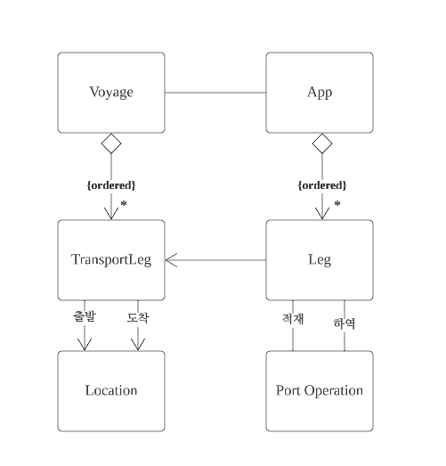
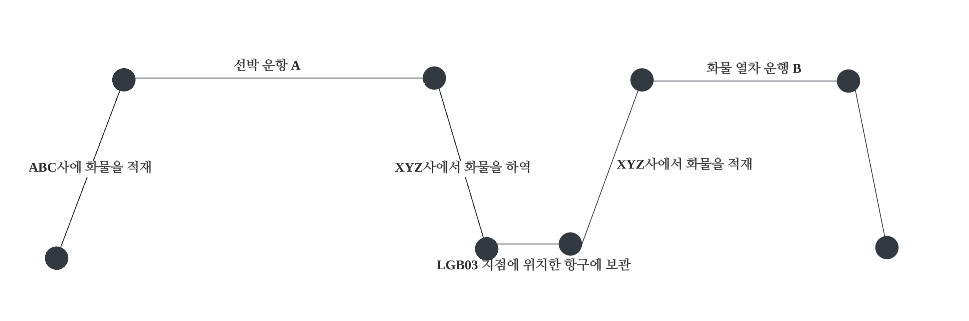

- [의사소통과 언어 사용](#의사소통과-언어-사용)
  * [보편 언어 (Ubiquitous Language)](#보편-언어-(Ubiquitous-Language))
    + [예제 (화물의 운송 항로 고안하기)](#예제-(화물의-운송-항로-고안하기))
  * [크게 소리내어 모델링하기](#크게-소리내어-모델링하기)
  * [한 팀, 한 언어](#한-팀,-한-언어)
  * [문서와 다이어그램](#문서와-다이어그램)
  * [글로 쓴 설계 문서](#글로-쓴-설계-문서)
    + [문서는 코드와 말을 보완하는 역할을 해야한다](#문서는-코드와-말을-보완하는-역할을-해야한다)
    + [문서는 유효한 상태를 유지하고 최신 내용을 담고 있어야 한다](#문서는-유효한-상태를-유지하고-최신-내용을-담고-있어야-한다)
  * [실행 가능한 기반](#실행-가능한-기반)
  * [설명을 위한 모델](#설명을-위한-모델)
    + [예제](#예제)

# 의사소통과 언어 사용
## 보편 언어 (Ubiquitous Language)
*공통 언어의 부재*  
- 도메인 전문가는 소프트웨어 개발에 사용되는 기술적인 전문 용어를 이해하기 어렵지만, 자기 전문 분야의 용어는 다양하게 사용할 것이다.  
- 개발자는 설계는 뒷받침 하지만 도메인 전문가가 이해할 수 없는 방식으로 이해할 수 없는 추상화를 하거나, 도메인 전문가의 언어에 담긴 의미를 이해하지 못한다.
- 도메인 전문가는 원하는 바를 모호하게 설명하고 개발자는 모호하게 이해하여 일부의 사람만 이해하고 그 사람들의 번역이 필요해져서 정보의 병목이 된다. 
- 도메인 전문가와 개발자가 서로의 언어를 각자 사용하여 일상적인 토론에서의 언어와 코드에 녹아든 용어가 단절된다.
- 번역은 의사소통을 무디게 하고 지식 탐구를 빈약하게 만든다. 오해의 위험이 크다.

*Ubiquitous Language(보편 언어) 사용*  
- 도메인 모델이 공통 언어의 근간을 제공한다.
- 모델 내에서 명시적으로 드러나는 규칙을 토론하기 위한 용어가 포함된다. (앞장에서 Policy 객체를 뽑아낸 것 처럼?)
- Ubiquitous Language를 구성하는 어휘는 클래스와 주요한 연산의 이름이 있다.
- 팀 내 의사소통을 소프트웨어 구현과 연결지을 수 있고, 업무 전반에 사용된다.
  - 팀 내 모든 의사소통, 코드, 다이어그램, 문서 등에서 사용되어야 한다.
- 지식 탐구 과정은 모델 기반 언어에 팀 전체가 헌신할 때 가능해진다.
- Ubiquitous Language를 지속적으로 사용하다보면 모델의 취약점이 드러난다. 실험을 토대로 부자연스러운 용어의 대안을 찾고, 토론을 통해 새로운 단어가 나타난다. 
  - **Ubiquitous Language의 변화는 모델의 변화**이다.
  - 용어의 의미가 바뀌면 클래스 다이어그램, 코드상의 클래스/메서드 이름, 동작 방식 등도 리팩토링한다.
- 도메인 전문가는 도메인을 이해하는데 부자연스럽고 부정확한 용어나 구조에 대한 반대 의사를 표명하고, 개발자는 설계를 어렵게 만드는 모호함과 불일치를 찾아서 지적하여 실행 가능한 대안을 생각해내게끔 해야한다.

### 예제 (화물의 운송 항로 고안하기)
**시나리오 1. 도메인에 대한 최소한의 추상화**  
- 사용자: 통관 지점이 바뀌면 항로 설정을 완전히 새로 해야 합니다.
- 개발자: 맞습니다. 저희는 운송 테이블에서 해당 화물 아이디를 지닌 행을 모두 삭제할 겁니다. 그러고 나서 Routing Service(항로 설정 서비스)에 출발지, 목적지, 새 통관 지점 데이터를 입력하고, Routing Service에서는 해당 데이터를 테이블에 재입력할 것입니다. 운송 테이블에 데이터가 있는지 판단하려면 Cargo(화물) 객체에 불린(Boolean) 값이 있어야 할 것니다.
- 사용자: ...통관 지점이 전혀 없는 경우에도 같은 작업을 해야합니다.
- 개발자: 물론이죠. 출발지, 목적지, 통관 지점을 변경하는 경우(또는 처음 입력하는 경우)에는 언제든 운송 데이터가 있는지 확인한 후 그것을 삭제하고 Routing Service로 다시 만들 것입니다.

운항 일정(Itinerary)을 속성(출발지, 목적지, 통관 지점)을 이용해 설명하고, 절차적으로 행위를 서술하고 있다.

 

**시나리오 2. 논의를 돕는 풍성한 도메인 모델**  
- 사용자: 그럼 통관 지점이 바뀌면 항로 설정을 완전히 새로 해야 합니다.
- 개발자: 맞습니다. Route Specification(항로 설정 명세)에 있는 속성 중 어떤 것이라도 변경할 때는 이전 Itinerary(운항 일정)를 삭제하고 Routing Service를 이용해서 새로운 Route Specification에 기반을 둔 새로운 운항 일정을 생성할 것입니다.
  - 운항 일정(Itinerary)이 객체로 표현
  - 항로 설정 명세를 속성과 절차적 측면이 아닌, 객체(항로 설정 명세, route specification) 로 표현

운항 일정, 항로 설정 명세를 객체로 표현하여 명확하고 구체적으로 논의하였다.

## 크게 소리내어 모델링하기
- 모델을 정제하는 가장 좋은 방법은 가능한 모델 변형을 구성하는 다양한 요소를 큰 소리를 말하면서 말하기를 통해 살펴보는 것이다. 다듬어지지 않은 표현은 쉽게 분간할 수 있다.
  - "Routing Service에 출발지, 목적지, 도착 시간을 전달하면 화물이 멈춰야 할 지점을 찾고, 그것을 데이터베이스에 삽입한다." (모호하고 기술적임)
  - "출발지, 목적지 등등을 모두 Routing Service에 넣으면 필요한 것이 모두 담긴 Itinerary를 돌려받는다." (좀 더 완전해졌지만, 장황함)
  - "Routing Service는 Route Specification을 만족하는 Itinerary를 찾는다." (간결함)
- 우리의 뇌는 구어를 활용해 복잡함을 다루는데 특화되있다.
  - ex. 사업상 다른 언어적 배경을 지닌 사람이 모인 경우 공통 언어가 없다면 혼성어를 만들어낸다. 원래 언어만큼은 아니지만, 당장 쓰기에 수월하다.
  - 이야기를 나눌 때 사람들은 단어의 해석과 의미에서 차이를 발견하고 해소한다.
- 시각적, 공간적 능력이 도식으로 나타낸 자료의 정보를 빠르게 전달/가공 하는 것 처럼 문법적, 의미적 언어에 대한 타고난 재능을 모델을 개발하는데 활용하는 것
- Ubiquitous Language를 논의할 때 서로에게 해당 언어의 미묘한 차이까지 가르칠 수 있는데, 다이어그램과 문서만으로는 일어날 수 없는 현상이다.
- 시스템에 관한 이야기를 주고받을 때 모델을 사용하고, 모델의 요소와 상호작용을 이용한 시나리오를 큰 소리로 말해보자.
- 표현해야 할 것을 더 쉽게 말하는 방법을 찾아 다이어그램과 코드에 적용하자.

## 한 팀, 한 언어
- (X) 두 가지 언어가 존재해야 한다? (ex. "도메인 모델이 업무 전문가들에게는 너무 추상적이라서요")
  - 설계는 도메인 전문가와 관련없는 기술적인 구성요소도 있지만 모델의 핵심은 도메인 전문가의 관심을 끌어야한다.
  - 도메인을 깊이 이해하고 있는 도메인 전문가도 모델을 이해하지 못하면 모델이 뭔가 잘못된 것이다.
- 모델이 존재하지 않는 초기 단계에서 모델을 찾는 과정은 부자연스럽지만 점차 정제될 것이다.  
  - 발전하는 과정에서 도메인 전문가는 해당 언어를 채택하고 기존 문서를 개정하기위해 노력해야한다.
- 개발자의 기술적 용어, 도메인 전문가의 전문 용어는 Ubiquitous Langauge의 확장 영역에 해당한다. 
  - 별개의 모델을 반영하면서 같은 도메인에서 쓰이는 대체 어휘가  포함되면 안된다.
- Ubiquitous Language가 마련되면 모든 것을 동일한 언어를 기반으로 해야 한다. 
  - 개발자간 대화, 도메인 전문가간 논의, 코드 등등 ...

## 문서와 다이어그램
- UML 다이어그램은 객체 간의 관계를 전달하거나 상호작용을 보이는데 좋다.
  - 그러나 객체의 개념적 정의를 전해주지는 못하여 말로 보충하거나 대화하면서 의미를 나타낼 수 있다.
  - 다디어그램이 최소화됬을 때 의사소통과 설명의 수단이며 브레인스토밍을 촉진하는 역할을 한다. 
- UML을 통해서만 전체 모델이나 설계를 전달해야한다고 느낄 때 문제가 생긴다.
  - 객체의 행위(behavior), 제약조건(constraint)을 그리기 수월하지 않다.
  - 행위적 책임을 넌지시 비추거나 시퀀스 다이어그램으로 암묵적으로 보여줄 수 있지만, 설명하지 못한다. 별도의 텍스트나 대화의 몫으로 남는다.
  - 세부사항이 읽는이를 압도하여 의사소통이나 설명의 목적을 달성하지 못한다.
- 텍스트 주석이 달린 다이어그램이 아닌 선택적이고 간결한 다이어그램이 그려진 텍스트 문서를 작성해야한다.
- **모델 != 다이어그램**
  - 다이어그램의 목적은 모델을 전달하고 설명하는 것이다.
  - 코드는 설계의 세부사항에 대한 저장소 역할을 할 수 있다.

## 글로 쓴 설계 문서
- 어떤 규모의 집단이든 문서로 안정과 공유를 꾀할 필요가 있지만, 도움이 되는 문서를 만들긴 쉽지 않다.
- 문서가 변하지 않게 되면 프로젝트의 흐름과 연관성을 잃어버리면서 코드의 발전과 프로젝트 언어 발전을 따라오지 못한다.
- 문서를 평가하는 두 가지 방법을 소개한다.

### 문서는 코드와 말을 보완하는 역할을 해야한다
- 애자일 프로세스 중 하나인 익스트림 프로그래밍은 여분의 설계 문서 없이 코드 스스로 별도의 설명이 없는 상태를 유지해야 한다는 입장을 옹호한다. 
  - 오직 실제 동작하는 영역과 실행 가능한 테스트에만 집중한다.
  - 문서는 거짓말을 하지만 실행되는 코드의 행위는 명백하다.
  - 코드에 달린 주석 조차도 행위에 영향을 주지 않고 실행코드와 모델과 일관성을 유지하지 못한다.
  - 코드가 의사소통 수단의 의미를 가지게 되어 개발자는 코드를 깔끔하게 유지할 필요성을 느끼게 된다.
- 설계 문서로서 코드에는 한계가 있다. 포괄적인 UML 다이어그램을 사용할때와 동일한 문제를 일부 지닌다.
  - 읽는이가 코드의 세부사항에 압도될 수 있다.
  - 행위 이면에 존재하는 의미를 전달하기 어렵다.
- 문서는 코드가 이미 잘 하고 있는 것을 하려고 해서는 안된다.
  - 대규모 구조에 통찰력을 주고 핵심요소에 집중해야 한다.
  - 프로그래밍 언어가 개념을 직관적으로 구현하기 어려우면 문서로 설계 의도를 표현해야 한다.

### 문서는 유효한 상태를 유지하고 최신 내용을 담고 있어야 한다
- 다이어그램을 손으로 그리면 임시적이라는 느낌을 주는 이점이 있다.
- 설계문서의 가장 큰 가치는 모델의 개념을 설명하고, 코드의 세부사항을 파악하는데 도움을 준다.
  - 팀의 철학에 따라 간단할 수도 있고, 상당한 양일 수 있다.
- 프로젝트 활동과 관련을 맺고 있어야한다. 
  - 확인할 수 있는 방법은 문서가 Ubiquitous Langauge와 상호작용 하는지 살펴보는 것이다.
    - 문서가 현재 프로젝트에서 쓰는 언어로 작성되있는가? 
    - 문서가 코드에 포함된 언어로 쓰여있는가?
  - 그렇지 않다면 문서가 본연의 목적을 수행하지 못하는 셈이다.
    - 문서가 너무 방대 혹은 복잡하거나 중요 주제에 초점을 맞추지 않고 있을 수 있다.
    - 그러면 사람들이 문서를 읽지 않거나 읽을 필요가 없다고 여긴다.
    - 문서가 중요한 역할을 수행하지 않는데 순수한 의지로 최신화하는 것은 노력의 낭비다.
- 문서를 최소화하고 코드와 대화를 보완하여 문서를 유효한 상태로 만들고 프로젝트를 연관된 상태로 유지할 수 있다.
  - Ubiquitous Language와 그것의 발전을 그 구심점으로 삼아야한다.

## 실행 가능한 기반
- 잘 작성된 코드는 의미 전달에 충실할 수 있지만 코드가 전달하는 메시지가 정확하는 보장은 없다.
  - 올바르게 실행뿐만 아니라 올바르게 의미를 전달하는 코드를 작성하려면 세심한 노력을 기울여야 한다.
- 불일치를 제거하는 것은 선언적 설계(10장에서 논의)와 같은 접근법에서 주로 강조하는 특징이다. 
  - 프로그램 요소의 목적을 서술하는 것이 프로그램 내의 실제 행위를 결정한다.
- 현재의 표준 기술을 활용해 코드의 행위, 의도, 메시지를 일치시켜려면 훈련과 설계에 대한 특정한 사고방식이 필요하다. (3부에서 논의)
- 의사소통을 효과적으로 하려면 코드는 요구사항과 다른 개발자 및 도메인 전문가와 이야기를 나눌 때 사용하는 것과 동일한 언어에 기반을 두어야 한다.

## 설명을 위한 모델
- **이 책의 요점은 "하나"의 모델이 구현, 설계, 의사소통의 기초가 되야 한다는 것이다.
- 모델은 도메인을 가르치는 도구로 유용할 수 있다.
- 다른 모델이 필요한 이유중 특별한 하나는 "범위" 때문이다. 
- 설명을 위한 모델은 객체 모델일 필요가 없다. 일반적으로는 오히려 아닌게 좋다.

### 예제
*운송 항로를 나타내는 클래스 다이어그램*  
  
모델에 항구에서 일어하는 하역 작업과 선박에 의한 항해가 화물에 관련된 운영 계획(하나의 "항로")으로 어떻게 조합되는지에 관한 관점이 자세히 표현되있다. 그러나 이와 관련된 업무 경험이 없는 사람에게는 클래스 다이어그램이 이해하는데 별로 도움이 되지 않을 수 있다.

 

*해운 항로에 대한 설명을 위한 모델*  
  
클래스 다이어그램과 상세히 대응하진 않지만 도메인의 핵심 개념을 밝히는데 도움을 준다.

개별 관점으로 바라볼 때 보다 이 둘이 함께할 때 이해하기가 더 쉽다.