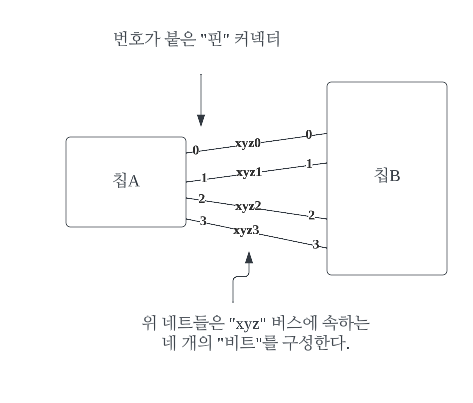

- [모델과 구현의 연계](#모델과-구현의-연계)
  - [MODEL-DRIVEN DESIGN (모델 주도 설계)](#model-driven-design-모델-주도-설계)
  - [모델링 패러다임과 도구 지원](#모델링-패러다임과-도구-지원)
    - [예제](#예제)
  - [내부 드러내기: 왜 모델이 사용자에게 중요한가](#내부-드러내기-왜-모델이-사용자에게-중요한가)
  - [HANDS-ON MODELER (실천적 모델러)](#hands-on-modeler-실천적-모델러)

# 모델과 구현의 연계
에릭 에반스의 썰
- 도메인의 상세 모델을 심층적으로 조사하고 개발해온 팀에 합류했다. 
- 객체는 복잡한 연관관계를 맺고 있었지만, 그 사이에 경계가 없었다.
- 거대한 다이어그램에서 학습한 내용은 애플리케이션 코드와 설계에 어떠한 통찰력을 줄 수 없었다.
- 도출된 모델은 구현 과정의 시행착오가 포함되지 않은 개념에 근거한 객체라 개발자는 그것을 활용할 수 없다고 판단하여 즉흥적으로 설계를 만들어갔고 기존 모델에 근거하지 않았다.
- 비대하고 이해하기 어렵고 유지보수가 불가능한 산출물이 만들어졌다.

*초기 분석 단계에 도움될 뿐 아니라 설계의 기반이 되는 모델이 필요하다.   
DDD에서 필요로 하는 모델링 접근법을 알아보자.*

## MODEL-DRIVEN DESIGN (모델 주도 설계)
코드와 그 기반 모델이 긴밀하게 연결되면 코드에 의미가 부여되고 모델과 코드가 서로 대응하게 된다.
<br> 

**설계와 동떨어진 분석 모델(analysis model)의 특징**  
1. 설계는 분석 모델과 느슨하게 대응할 수 있다.
   - 분석 모델은 설계와 뚜렷이 구분되며 보통 분석자와 설계자가 다르다.
   - 소프트웨어 시스템에서 역할을 고려하지 않고, 업무 도메인의 개념을 체계화하는게 목적이다.
   - 설계상의 쟁점들을 염두에 두고 만들어진 것이 아니라서 모델과 설계의 연결을 분석 모델로 진행한다는 것은 매우 비현실적일 가능성이 높다.
2. 설계와 느슨하게 연결된 모델 간의 대응을 유지하는 것은 비용대비 효과가 높지 않다.
   - 분석 단계에서 얻은 지식 탐구의 성과 대부분이 코딩 및 설계를 위한 추상화를 할 때 사라진다.
   - 분석가에게 얻은 통찰력과 모델에 담긴 통찰력이 보존되거나 재발견되리라 보장할 수 없다. 
3. 이론에 치우친 분석 모델은 심지어 도메인의 이해라는 가장 주된 목표에 미치지 못하기도 한다.
   - 중요한 발견은 설계/구현 중에 나타나므로 코딩이 시작되면 분석 모델은 폐기된다.
4. 설계의 기반이 되는 개념이 부족한 소프트웨어는 해당 소프트웨어의 행위를 설명하지 못한 채 그저 유익한 일을 수행하는 메커니즘 정도밖에 되지 못한다.
  - 설계 혹은 설계의 주된 부분이 도메인 모델과 대응하지 않는다면 그 모델은 그다지 가치가 없으며 소프트웨어의 정확함도 의심스러워진다. 
  - 동시에 모델과 설계 기능 사이의 복잡한 대응은 이해하기 힘들고, 설계가 변경되면 유지보수가 불가능해진다. 
  - 분석과 설계가 치명적으로 동떨어지고, 그에 따라 각자의 활동에서 얻은 통찰력이 서로에게 전해지지 않는다.  
<br>

**모델과 설계의 연계 (=MODEL-DRIVEN DESIGN?)**
- MODEL-DRIVEN DESIGN 에서는 분석 모델과 설계를 나누지 않고 양쪽 모두의 목적을 달성하는 단일 모델을 찾는다. 
  - 순수하게 기술적인 쟁점은 배제함으로써 설계상의 각 객체는 모델에서 기술한 개념적 역할을 수행하게 된다. 
  - 모델은 상이한 두 가지 목표를 달성해야 해서 부담이 커진다.
- 도메인을 추상화하는 방법과 애플리케이션의 문제를 해결할 수 있는 설계 방법은 여러가지기 때문에 모델과 설계를 연계하는 것은 실용적이다.
  - 그렇다고 연계하는 과정에서 기술적 고려사항 탓에 분석이 심각하게 타협된 상태에 놓여서는 안된다. 
  - 마찬가지로 도메인 아이디어는 반영하지만 소프트웨어 설계 원칙은 따르지 않은 서툰 설계를 받아들여서도 안된다. 
  - 이 접근법에는 분석과 설계 관점에서 모두 효과적인 모델이 필요하다. 
- 많은 고민, 수차례의 반복주기, 상당한 리팩터링 -> 관련성 있는 모델이 만들어진다.  
<br>

**MODEL-DRIVEN DESIGN 정리**
- 소프트웨어 시스템의 일부를 설계할 때 도메인 모델을 있는 그대로 반영해서 설계와 모델의 대응을 분명하게 해라.
- 모델로부터 설계와 기본적인 책임 할당에 사용한 용어를 도출해라.
  - 코드 작성시 용어 사용 -> 코드가 모델을 표현한 감 -> 코드의 변경이 모델의 변경
  - 위 효과는 프로젝트의 나머지 활동에도 퍼져나가야 함
- 구현을 모델과 묶으려면 객체지향 프로그래밍 같은 모델링 패러다임을 지원하는 개발 도구와 언어가 필요
- 시스템의 특정 부분에는 코드에서 요구사항 분석에 이르기까지의 개발 노력의 모든 측면에 오로지 하나의 모델만이 적용되야 한다.
- 단일 모델은 오류가 일어날 확률을 줄인다. 이는 이제 설계가 주의 깊게 고려한 모델의 직접적인 결과물에 해당하기 때문이다. 그래서 설계, 심지어 코드 자체도 모델의 전달력을 갖추게 된다.

## 모델링 패러다임과 도구 지원
- 객체지향 프로그래밍은 모델링 패러다임에 근거하고 모델의 구성요소에 대한 구현을 제공하기 때문에 매우 효과적이다.(자바 등)
  - C 같은 절차지향 언어는 복잡한 자료형을 지원하기도 하지만 이는 단순히 조직화된 데이터일 뿐 도메인의 활동적인 측면을 담지 못한다. 
  - 따라서 이 책에서는 객체지향 설계를 주요 접근법으로 사용

### 예제
- PCB: 다수의 컴포넌트의 핀을 연결하는 전도체(네트)의 집합  
- PCB 레이아웃 도구: 네트가 서로 교차하거나 방해하지 않게끔 모든 네트의 물리적인 배열을 찾아내는 소프트웨어
- PCB 레이아웃 도구의 문제점: 
  - 수천개의 네트가 각각 고유한 레이아웃 규칙을 지니고 있다.   
    PCB 엔지니어들은 자연스럽게 특정 그룹에 속하는 여러 네트가 서로 동일한 규칙을 공유해야하는 것으로 본다.  
    예를 들어 어떤 네트들은 '버스'를 구성하기도 한다.  
    *레이아웃 도구에는 '버스' 같은 개념이 없어서 규칙이 네트에 한 번에 하나씩 할당되야 한다.*




**기계적인 설계**  
레이아웃 도구의 제약을 해결하고자 별도의 스크립트를 작성한다.   
(레이아웃 도구의 데이터 파일을 파싱하고 레이아웃 규칙을 삽입하는 스크립트)
* 단순한 요구사항이라면 일리가 있지만, 현실에서는 훨씬 많은 스크립트가 존재할 것.
  * 스크립트를 리팩토링해도 스크립트는 단순히 파일을 조작하는 것에 불과하다.
  * 파일 형식이 다르면 버스를 그룹화하고 규칙을 적요하는 개념이 동일해도 처음부터 다시 시작해야 한다.
  * 좀 더 풍부한 기능과 상호작용을 원하면 그에 상응하는 대가를 치러야 한다.
* 정렬과 문자열 일치를 통해 버스의 존재를 추론하지만, 명시적으로 다루지 않는다.
* 테스트가 어렵다. 파일 입력 -> 출력을 비교해야한다.

**모델 주도 설계**  
  
> 효율적인 레이아웃 규칙 정렬을 지향하는 클래스 다이어그램

| 서비스   | 책임                                                      |
| -------- | --------------------------------------------------------- |
| 가져오기 | 네트 목록 파일 읽고 각 항목에 대한 인스턴스 생성          |
| 내보내기 | 특정 네트 집합에 대해 첨부된 모든 규칙을 규칙 파일에 기록 |

| 유틸리티 클래스   | 책임                                                      |
| -------- | --------------------------------------------------------- |
| 네트 리파지터리 | 이름을 기준으로 네트에 접근하게 해준다.          |
| 추론된 버스 팩터리 | 특정 네트 집합에 대해 며명규칙을 이용해 버스를 추론하고 인스턴스를 생성한다. |
| 버스 리파지터리 | 이름을 기준으로 버스에 접근하게 해준다. |


```java
// 초기화
Collection nets = NetListImportService.read(aFile);
NetRepository.addAll(nets);
Collection buses = InferredBusFactory.groupIntoBuses(nets);
BusRepository.addAll(buses);

// Bus Rule 할당
Bus bus = BusRepository.getByName(busName);
bus.assignRule(NetRule.create(ruleType, parameter));

// 내보내기
NetRuleExport.write(aFileName, NetRepository.allNets());
```

- 쉽게 규모를 확장할 수 있다.
- 규칙과 기타 개선사항을 결합하는 것과 관련된 제약조건을 포함할 수 있다.
- 각 컴포넌트에서 단위 테스트할 인터페이스를 제공하여 테스트하기 쉽다.

> 이러한 설계는 한번에 나타나지 않고, 리팩터링과 지식 탐구의 과정을 수차례 반복해야 한다.

## 내부 드러내기: 왜 모델이 사용자에게 중요한가
- 사용자가 바라보는 것과 시스템이 불일치 한다면 혼란 또는 버그를 일으킨다.
  - ex) 인터넷 익스플로러의 "즐겨찾기"
    - 즐겨찾기는 URL이 저장된 파일로 간주하기 때문에 일부 특수문자를 사용할 수 없음
      - 그래서 인터넷 익스플로러는 특수문자가 포함되면 임의로 특수문자를 제거하고 저장한다.
      - 사용자가 기대하는 바가 아닐 것. 
    - 사용자 모델과 설계/구현 모델이 별도로 존재해서 생긴 문제
      - 차라리 "파일" 임을 드러내고, 파일처럼 오류 메시지를 출력하면 덜 혼동된다.
        - 유저가 파일 시스템 지식을 즐겨찾기에 활용할 수도 있다.
      - 또는 즐겨찾기 자체적인 규칙을 만들어 단일한 모델을 제공한다.
- 모델이 드러나면 사용자가 소프트웨어의 잠재력을 좀 더 많이 접하여 일관성있고 예상 가능한 행위가 나타난다.

## HANDS-ON MODELER (실천적 모델러)
- 분석, 모델링, 설계, 프로그래밍의 책임을 지나치게 나누는 것은 MODEL-DRIVEN DESIGN과 상충한다.
- MODEL-DRIVEN DESIGN을 코드로 만드는 과정의 미묘한 사항들은 협업을 통해 알 수 있는데, 설계자가 구현을 하지 못해 개발자와 업무의 단절이 생기면 숙련된 설계자의 지식과 솜씨는 결코 다른 개발자에게 전해지지 못할 것이다.
- MODEL-DRIVEN DESIGN에서 코드는 모델의 한 표현프로그래머가 곧 모델러다.
- 모델에 기여하는 모든 사람은 역할과 상관 없이 코드를 접해야 한다.
  - 코드를 변경하는 책임이 있는 모든 이들은 코드를 통해 모델을 표현하는 법을 반드시 배워야 한다. 
  - 모든 개발자는 모델에 관한 일정 수준의 토의에 깊이 관여해야 하고 도메인 전문가와도 접촉해야 한다. 
  - 다른 방식으로 모델에 기여하는 사람들으 의식적으로 코드를 접하는 사람들과 UBIQUITOUS LANGUAGE를 토대로 모델의 아이디어를 나누는데 적극 참여해야 한다.